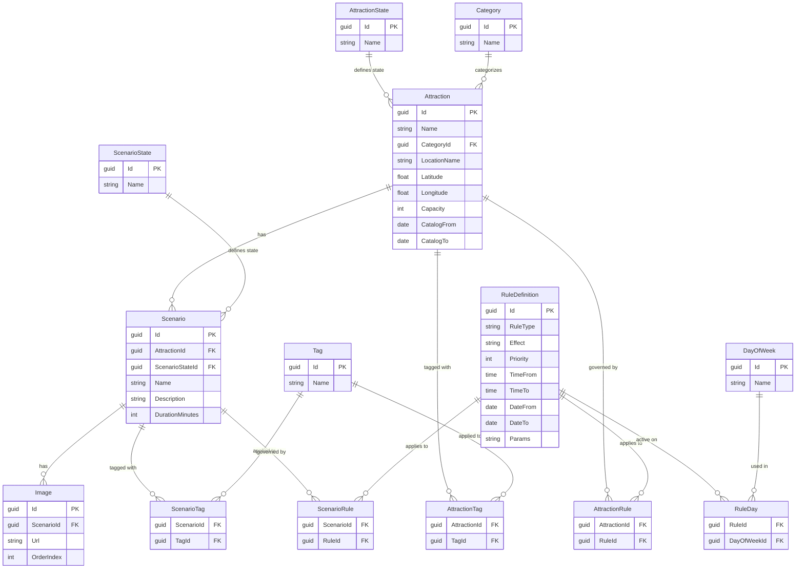

# System Planowania Atrakcji Turystycznych

## Opis aplikacji

Aplikacja mobilna do odkrywania i planowania wizyt w atrakcjach turystycznych. Głównym mechanizmem jest interfejs przypominający swipowanie — użytkownik otrzymuje atrakcje dostępne w pobliżu jego lokalizacji i decyduje co go interesuje. Na podstawie wyborów aplikacja pomaga zbudować spersonalizowany plan zwiedzania.

System zbudowany jest zgodnie z zasadami **Domain-Driven Design (DDD)** oraz **Clean Architecture**, z wyraźnym podziałem na warstwę domenową, aplikacyjną, infrastrukturę i REST API.

---

## Jak działa aplikacja

Użytkownik otwiera aplikację, podaje swoją lokalizację, promień wyszukiwania oraz zakres dat. System zwraca dostępne atrakcje spełniające te kryteria. Użytkownik swipuje przez nie — akceptując lub odrzucając każdą. Na końcu aplikacja na podstawie zaakceptowanych atrakcji buduje zoptymalizowany plan zwiedzania.

**Kluczowa zasada projektowa: użytkownik swipuje scenariusze, nie atrakcje.**

To rozróżnienie jest fundamentem architektury i wyjaśnione jest szczegółowo poniżej.

---

## Kluczowe Koncepty

### Atrakcja vs Scenariusz — "Definicja vs Instancja"

Jedną z najważniejszych decyzji architektonicznych jest rozdzielenie `Attraction` od `Scenario`.

`Attraction` to **definicja** — koncept backendowy reprezentujący miejsce lub aktywność. Przechowuje lokalizację, kategorię, globalne reguły dostępności i stan cyklu życia. Użytkownik nigdy bezpośrednio nie wchodzi w interakcję z `Attraction`.

`Scenario` to **produkt** — konkretny sposób doświadczenia atrakcji. To właśnie to użytkownik widzi, swipuje i wybiera. Każdy `Scenario` ma własną nazwę, opis, czas trwania, zdjęcia, tagi i reguły dostępności.

**Przykład:**

> Kopalnia Wieliczka (`Attraction`) ma dwa scenariusze:
> - "Trasa Turystyczna" — 3 godziny, dla rodzin, otwarta pon–nd (`Scenario`)
> - "Trasa Górnicza" — 5 godzin, tylko dla dorosłych, otwarta sob–nd (`Scenario`)

Użytkownik widzi i swipuje te dwa scenariusze niezależnie. Odrzucenie jednego nie wpływa na drugi.

To podejście pozwala systemowi obsługiwać muzea, mecze sportowe, koncerty, rejsy i szlaki turystyczne **dokładnie w ten sam sposób** — wszystkie są `Attraction` z jednym lub więcej `Scenario`.

---

### Cykl Życia Atrakcji

Każda `Attraction` ma stan zarządzany przez `AttractionState`:

| Stan | Znaczenie |
|---|---|
| `Draft` | W przygotowaniu, niewidoczna dla użytkowników |
| `Catalog` | Aktywna i widoczna w wynikach wyszukiwania |
| `Internal` | Dostępna tylko jako część produktu grupowego |
| `Archived` | Wycofana z oferty, ukryta przed użytkownikami |

Każdy `Scenario` ma własny niezależny stan (`ScenarioState`) z tymi samymi wartościami. Oznacza to że jeden scenariusz atrakcji może być zarchiwizowany podczas gdy inny pozostaje aktywny.

**Przykład:**

> Scenariusz muzeum "Wystawa Czasowa" jest archiwizowany po zakończeniu wystawy, ale scenariusz "Kolekcja Stała" pozostaje w stanie `Catalog`.

---

### Globalny Wyłącznik vs Szczegółowe Reguły

`Attraction` posiada dwa pola — `CatalogFrom` i `CatalogTo` — które działają jak **globalny włącznik awaryjny** dla wszystkich jej scenariuszy.

`RuleDefinition` obsługuje **szczegółową dostępność** na poziomie atrakcji i scenariusza.

**Dlaczego oba mechanizmy?**

> Jeśli Kopalnia Wieliczka zostanie zalana wodą, ustawienie `CatalogTo = dzisiaj` na `Attraction` natychmiast usuwa zarówno Trasę Turystyczną jak i Górniczą z wyników wyszukiwania — bez dotykania każdego scenariusza osobno.
>
> Jednocześnie `RuleDefinition` obsługuje niuanse: Trasa Górnicza dostępna jest tylko w weekendy (`DayOfWeek`), tylko od maja do września (`DateFrom`/`DateTo`), i tylko między 09:00 a 17:00 (`TimeFrom`/`TimeTo`).

---

### Tagi — Dwa Poziomy

Tagi istnieją na dwóch poziomach:

`AttractionTag` — szerokie, ogólne tagi opisujące charakter miejsca (np. `muzeum`, `outdoor`, `sport`, `historyczne`).

`ScenarioTag` — szczegółowe tagi opisujące konkretny wariant (np. `audio-przewodnik`, `dla-rodzin`, `nocna-trasa`, `dostępne-dla-niepełnosprawnych`).

Gdy użytkownik filtruje po tagu, system łączy oba poziomy aby znaleźć pasujące scenariusze.

**Przykład:**

> Użytkownik filtruje po `muzeum` + `audio-przewodnik`.
> System znajduje wszystkie scenariusze oznaczone tagiem `audio-przewodnik`, których atrakcja nadrzędna jest oznaczona tagiem `muzeum`.

---

### Reguły Dostępności

`RuleDefinition` to elastyczny, data-driven silnik reguł. Zamiast hardkodować logikę biznesową, reguły są przechowywane jako rekordy w bazie danych i ewaluowane w czasie zapytania.

Każda reguła posiada:
- `RuleType` — `Weekly`, `Seasonal` lub `DateException`
- `Effect` — `Allow` lub `Deny`
- `Priority` — wyższy numer wygrywa przy konflikcie reguł
- `TimeFrom` / `TimeTo` — godziny otwarcia
- `DateFrom` / `DateTo` — zakres dat obowiązywania
- `DayOfWeek` — dni tygodnia w których reguła obowiązuje (przez tabelę pośrednią `RuleDay`)
- `Params` — pole JSON na dodatkowe parametry

Reguły są współdzielone — jedna reguła może być podpięta do wielu atrakcji lub scenariuszy. Zmiana reguły aktualizuje wszystkie powiązane encje jednocześnie.

**Przykład:**

> Reguła: `Weekly` | `Allow` | `pon–pt` | `09:00–17:00`
> Podpięta do: Muzeum Narodowego (poziom atrakcji) i scenariusza "Zwiedzanie z Przewodnikiem".
>
> Reguła: `DateException` | `Deny` | `1 Maja`
> Podpięta do: wszystkich atrakcji w systemie — jedna reguła, stosowana wszędzie.

---

### Wyszukiwanie po Lokalizacji

Każda `Attraction` przechowuje współrzędne geograficzne (`Latitude`, `Longitude`) wraz z czytelną nazwą lokalizacji (`LocationName`). Dla tras i szlaków lokalizacja reprezentuje **punkt startowy**.

Podczas wyszukiwania użytkownik podaje:
- Swoje aktualne współrzędne
- Promień wyszukiwania (w km)
- Zakres dat

System filtruje scenariusze których atrakcja nadrzędna mieści się w promieniu oraz których reguły dostępności pokrywają żądany zakres dat.

---

## Schemat Bazy Danych (ERD)

---

## Architektura

System oparty jest na **Clean Architecture** z **Portami i Adapterami**:

- **Warstwa Domenowa** — rdzeń logiki biznesowej, encje, value objecty, specyfikacje. Brak wiedzy o bazach danych i frameworkach.
- **Warstwa Aplikacyjna** — przypadki użycia i orkiestracja. Wywołuje obiekty domenowe, nic nie wie o infrastrukturze.
- **Warstwa Infrastruktury** — dostęp do bazy danych, implementacje repozytoriów, integracje zewnętrzne.
- **Warstwa API** — kontrolery REST wystawiające endpointy. Tłumaczy żądania HTTP na wywołania warstwy aplikacyjnej.

### Moduły (Bounded Contexts)

- **AttractionDefinition** — zarządza cyklem życia atrakcji i scenariuszy (Draft → Catalog → Archived), kategoriami, tagami i regułami dostępności.
- **CatalogSearch** — silnik wyszukiwania filtrujący scenariusze po lokalizacji, zakresie dat, tagach i regułach dostępności.
- **TripPlanning** *(planowany)* — interfejs swipowania i budowania planu zwiedzania na podstawie wyborów użytkownika.

---

## Kluczowe Decyzje Projektowe

**Dlaczego reguły są przechowywane jako dane a nie kod?**
Reguły są zapisane jako rekordy w bazie (`RuleDefinition`) zamiast być zakodowane w logice aplikacji. Dzięki temu dostępność można aktualizować bez ponownego wdrożenia — admin zmienia rekord, system natychmiast to odzwierciedla.

**Dlaczego reguły są współdzielone między encjami?**
Jedna `RuleDefinition` może być podpięta do wielu atrakcji i scenariuszy. Reguła "zamknięte w święta państwowe" jest tworzona raz i linkowana do każdej odpowiedniej encji. Zmiana tej reguły aktualizuje je wszystkie jednocześnie.

**Dlaczego `Scenario` ma własny stan niezależny od `Attraction`?**
Miejsce może mieć wiele wariantów — niektóre aktywne, inne nie. Archiwizacja jednego scenariusza nie powinna wpływać na pozostałe. Daje to precyzyjną kontrolę bez powielania globalnego stanu.

**Dlaczego nie ma `AttractionGroup` ani `AttractionRelation`?**
W tej aplikacji użytkownik sam buduje swój plan przez swipowanie. Nie ma predefiniowanych pakietów ani wymuszonych kolejności. Każdy scenariusz jest niezależnym produktem — użytkownik decyduje co łączy ze sobą.

**Dlaczego `Attraction` ma `CatalogFrom`/`CatalogTo` skoro są reguły?**
To dwa różne mechanizmy o różnych odpowiedzialnościach. `CatalogFrom`/`CatalogTo` to globalny wyłącznik awaryjny dla całej atrakcji i wszystkich jej scenariuszy naraz. `RuleDefinition` obsługuje szczegółową dostępność na poziomie konkretnego scenariusza. Jeden wyłącznik globalny, drugi precyzyjny.
